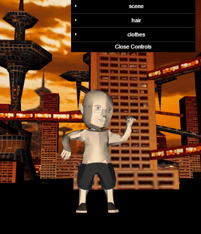

# glAvatar

(Potentially) a glTF extension (extra?) for avatar with switchable skeletons, skins, clothes, etc.

An open source assest library of 3D avatar content creation where artists can contribute.

## Demo




## Overview

3D avatar content creation is widely used but can be expensive. 

A switchable avatar system is very useful in games, 3D apps, VR and AR, etc.

glAvatar will make the contents and skeletons contributed by artists work together in an engine or app/game logic - agnostic way, and meanwhile keeps the switchable feature if wanted.

The system has two types of glTF files: 
* skeleton file
    * is a valid renderable glTF file by itself
    * contains joint nodes
    * usually doesn't contain a skinned mesh
* content file
    * is a valid renderable glTF file by itself (e.g. can be used to render icons)
    * contains skinned mesh on certain skeleton
    * node with skinned mesh uses the extension to link to skins from skeleton file


A combination of skeleton file and several content files will be rendered as an complete avatar with switchable skin meshes, or can be merged and output as one glTF file (The merge may be implemented in glTF-pipeline).

glAvatar is an extension that is not required, meaning it is not necessary to support it by engine to if only the purpose is render these glTF files separately as common ones.

There wil be a set of glAvatar skeleton files, and authoring tool project file (.blend and etc.) provided for artist to create clothes, skins, accessories that binded to these skeletons. When exported as glAvatar glTF, the joint nodes will be dimissed. 

There are some other potential ideas: 
* rigidbind (attach to joint node)
```json
"nodes": [
    {
        "name": "sword",
        "mesh": 0,

        "extensions": {
            "gl_avatar": {
                "skin": {
                    "name": "chibi-human",
                    "joint": 3
                }
            }
        }
    }
]
```

* switchable textures
* use morph targets for face, skin, musle shape custom controlling
* invisible base skin lookup texture, and visible array for clothes

## Things to implement

* Web3D avatar renderer
    * shows arbitrary combination of skin models
    * export the avatar as a glTF model by merging parts
* Template blender project file with skeleton
* Exporter in blender glTF models with glAvatar extensions
    * might extend [Blender glTF 2.0 Exporter](https://github.com/KhronosGroup/glTF-Blender-Exporter)
* Online asset library for model contributions?
* Separate animation to a standalone and animation file format (like CZML?)
* Animation mapping standard, like the humanoid in Unity3D, so animations are not limited to certain skeleton. Animation and skeletons can make arbitrary combinations. 

## Use case

* glTF 3D avatar model generator for 3D app, indie game dev, etc.
* Potentially be used as an standard output format of current character generator software: [IClone character generator](https://www.reallusion.com/character-creator/), [Autodesk character generator](https://www.autodesk.com/products/character-generator/overview)
* Avatars for Web3D/VR social experience: [Facebook Spaces](https://www.facebook.com/spaces), [AltspaceVR](https://altvr.com/), [imvu](https://secure.imvu.com/welcome/ftux/)
* 3D contents for AR apps: [Google-ARCore](https://experiments.withgoogle.com/ar)
* Avatar for virtual performers (Live Show, Streammer, [MMD](https://learnmmd.com/downloads/)): [Miku](https://www.youtube.com/watch?v=dhYaX01NOfA), [Kizuna AI](https://www.youtube.com/channel/UC4YaOt1yT-ZeyB0OmxHgolA)
* 3D Avatars, [3D Memes](https://github.com/shrekshao/gltf-emoji) for traditional online community: [glTF html tag renderer](https://github.com/AVGP/gltf-viewer)

## Motivation


## Example


### A skeleton glTF file
```json
{
    "extensionsUsed": [
        "gl_avatar"
    ],
    "extensions": {
        "gl_avatar": {
            "skins": {
                "chibi-human": 0
            }
        }
    },
    "nodes": [
        {
            "name": "scene-root",
            "children": [2, 1]
        },
        {
            "name": "pelvis",
            "children": [3, 4, 5],
            "translation": [0.0, 1.0, 0.0],
            "rotation": [0.0, 0.0, 0.0, 1.0],
            "scale": [1.0, 1.0, 1.0]
        },
        {
            "name": "chest",
            "children": [6],
            "translation": [0.0, 0.5, 0.0]
        },
        {
            "name": "left-leg"
        },
        {
            "name": "right-leg"
        },
        {
            "head": "head"
        }
    ],
    "skins": [
        {
            "name": "chibi-human",

            "inverseBindMatrix": 0,
            "joints": [2, 3, 4, 5, 6]
        }
    ],
    "...": "..."
}
```

### A content (clothes, armor, weapon, skins, etc.) glTF file
```json
{
    "extensionsUsed": [
        "gl_avatar"
    ],
    "extensions": {
        "gl_avatar": {
            "visible": [1, 1, 1, 0, 1]
        }
    },
    "nodes": [
        {
            "name": "jeans",
            "mesh": 0,

            "extensions": {
                "gl_avatar": {
                    "skin": {
                        "name": "chibi-human",
                        "inverseBindMatrices": 9
                    }
                }
            }
        }
    ],
    "meshes": [
        {
            "primitives": [
                {
                    "attributes" : {
                        "POSITION": 0,
                        "...": "...",
                    },
                    "...": "...",
                    "extensions": {
                        "gl_avatar": {
                            "attributes": {
                                "JOINTS_0": 1,
                                "WEIGHTS_0": 2
                            }
                        },
                        "//comment": "this part is not necessary, depending on the engine implementation"
                    }
                }
            ]
        }
    ],
    "materials": {
        "...": "...",
        "extensions": {
            "gl_avatar": {
                "//comment": "used for make part of based skin invisible, only appears in base skin",
                "body_part_id_texture_id": 2
            }
        }
    },
    "...": "..."
}
```


## Spec